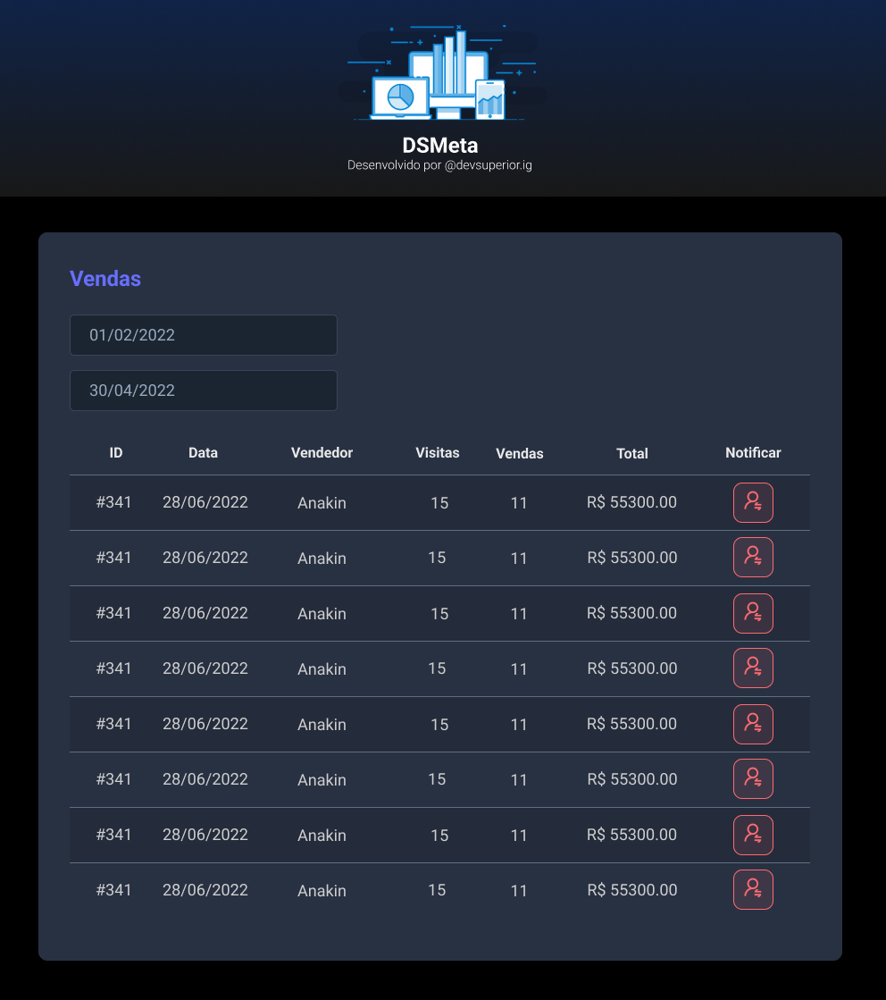

#  App DSMeta - Desenvolvido na Semana Spring React - DevSuperior

>

## Tecnologias utilizadas

-API REST com Java e Spring Boot
-Banco de DAdos com ORM
-Front end com ReactJS
-Integração com SMS
-Implantação na nuvem com CI/CD

### Hospedagem

- Front End Vercel

#

Link [DSMeta]()

#

## Layout



## Bibliotecas Utilizada

```bash

```

```bash

```

## Uso

```js

```
